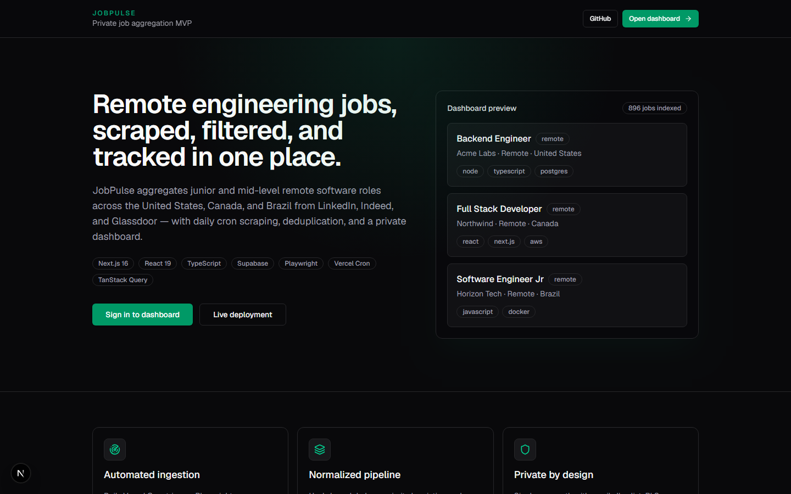
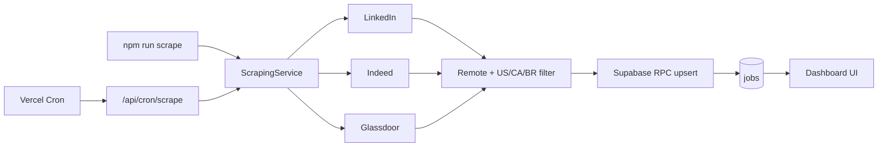

# JobPulse

[](https://github.com/giovaniohira/job-board-agreggator/actions/workflows/ci.yml)

Private job aggregator for a single user. Scrapes junior and mid-level **remote** software roles in the **United States, Canada, and Brazil** from LinkedIn, Indeed, and Glassdoor, deduplicates them, and surfaces everything in a focused dashboard.

**Live:** [job-board-pulse.vercel.app](https://job-board-pulse.vercel.app) · **Landing:** [job-board-pulse.vercel.app](https://job-board-pulse.vercel.app/) · **Repo:** [github.com/giovaniohira/job-board-agreggator](https://github.com/giovaniohira/job-board-agreggator)



---

## Highlights

- Public landing page with product overview and architecture
- Single-user auth (Supabase) with email allowlist
- Daily automated scrape via Vercel Cron (9:00 AM BRT)
- Playwright scrapers with serverless-safe Chromium on Vercel
- Hash-based deduplication and scrape run logging
- Dashboard stats strip + filters (source, remote, seniority, country, stack)
- CI: lint, unit tests, and production build on every push

## Stack

| Layer | Tech |
| --- | --- |
| Frontend | Next.js 16 (App Router), React 19, Tailwind CSS 4 |
| Backend | Route handlers, Server Actions, Zod |
| Database | Supabase Postgres + RLS |
| Auth | Supabase Auth (SSR cookies) |
| Scraping | Playwright + `@sparticuz/chromium` |
| Hosting | Vercel (Cron Jobs, serverless functions) |
| Client data | TanStack Query |
| Testing | Vitest |

## Architecture



## Technical decisions

| Decision | Why |
| --- | --- |
| **Supabase RPC for cron writes** | Avoids storing a service role key on Vercel while still allowing secure upserts |
| **`@sparticuz/chromium` + file tracing** | Playwright needs `browsers.json` at runtime; explicit tracing fixes serverless crashes |
| **Pipeline filter before upsert** | Keeps only remote roles in US/CA/BR — business rules enforced at ingestion, not just UI |
| **Hash dedup** | Stable identity across sources without relying on external IDs that change per board |

## Scraping rules

**Keywords:** software engineer, backend, full stack, frontend, Node.js, React

**Markets:** United States, Canada, Brazil — remote only

**Seniority:** junior, mid, or unknown (senior titles are dropped)

**Sources:** LinkedIn, Indeed, Glassdoor (each scraper runs independently; partial failures are logged)

## Getting started

### Prerequisites

- Node.js 20+
- A Supabase project
- Playwright Chromium (`npx playwright install chromium`)

### 1. Install

```bash
git clone https://github.com/giovaniohira/job-board-agreggator.git
cd job-board-agreggator
npm install
npx playwright install chromium
```

### 2. Supabase setup

1. Create a project at [supabase.com](https://supabase.com)
2. Run migrations in order via the SQL Editor:
   - `supabase/migrations/001_initial_schema.sql`
   - `supabase/migrations/002_cron_rpc_functions.sql`
3. Disable public sign-ups (Auth → Providers → Email)
4. Create your allowed user in Auth → Users
5. Add the production site URL to Auth redirect URLs when deploying

### 3. Environment variables

```bash
cp .env.example .env.local
```

| Variable | Required | Description |
| --- | --- | --- |
| `NEXT_PUBLIC_SUPABASE_URL` | Yes | Supabase project URL |
| `NEXT_PUBLIC_SUPABASE_ANON_KEY` | Yes | Supabase anon key |
| `SUPABASE_SERVICE_ROLE_KEY` | Local only | Optional locally; cron uses RPC + anon key in production |
| `ALLOWED_USER_EMAIL` | Yes | Only email allowed to sign in |
| `CRON_SECRET` | Yes | Min 16 chars; Vercel sends `Authorization: Bearer <CRON_SECRET>` |

### 4. Run locally

```bash
npm run dev
```

Open [http://localhost:3000](http://localhost:3000) for the public landing page, or sign in at `/login`.

### 5. Manual scrape

```bash
npm run scrape
```

Or call the cron route:

```bash
curl -H "Authorization: Bearer $CRON_SECRET" http://localhost:3000/api/cron/scrape
```

### 6. Tests & CI

```bash
npm run test
npm run lint
npm run build
```

GitHub Actions runs the same checks on every push to `master`.

## Deployment (Vercel)

1. Import the GitHub repo in Vercel (Git-connected deploys recommended)
2. Set all env vars from `.env.example` (use `--value` when adding `CRON_SECRET` to avoid trailing whitespace)
3. Deploy — `postinstall` installs Playwright Chromium on the build machine
4. Cron schedule in `vercel.json`:

```json
{
  "crons": [{ "path": "/api/cron/scrape", "schedule": "0 12 * * *" }]
}
```

Runs **once per day at 12:00 UTC (9:00 AM Brazil time)**.

## Project structure

```
src/
├── actions/           # Auth + job server actions
├── app/
│   ├── api/cron/scrape/
│   ├── api/jobs/
│   ├── dashboard/
│   └── login/
├── components/        # Landing, dashboard UI, shadcn-style primitives
├── lib/               # Supabase clients, env, hashing, types
├── repositories/      # Jobs + scraping runs data access
├── scrapers/          # Playwright scrapers + pipeline filters
└── services/          # Scraping orchestration
supabase/migrations/   # Schema + cron RPC functions
scripts/               # Manual scrape + deploy helpers
.github/workflows/     # CI pipeline
docs/                  # README assets
```

## Scripts

| Command | Description |
| --- | --- |
| `npm run dev` | Start development server |
| `npm run build` | Production build |
| `npm run start` | Start production server |
| `npm run scrape` | Run all scrapers manually |
| `npm run test` | Run unit tests (Vitest) |
| `npm run lint` | ESLint |
| `npm run deploy:vercel` | Vercel SDK deploy helper |

## Known limitations

- Job boards actively block bots — selectors break, CAPTCHAs happen
- Indeed and Glassdoor are less reliable than LinkedIn in practice
- Seniority and remote type are inferred from text, not structured data
- `posted_at` is often missing from search result pages
- Single-user by design — not multi-tenant
- One cron slot on Vercel Hobby (daily scrape only)

## License

Open source — live dashboard access remains private.
